# SlopChop

**AI writes slop. You chop it clean.**

---

## The Story

I'm a product designer, not a developer. But I ship production code, entirely through conversation with LLMs.

That only works if you're rigorous. Small files the AI can reason about fully. Low complexity so logic stays testable. No truncation, ever. Hard constraints, enforced at every commit.

I built **SlopChop** to hold that line. It's the gatekeeper between AI output and my codebase: if the code doesn't meet the spec, it doesn't land.
Every line of this tool was written by AI. It passes its own rules.

---

## What Is This?

SlopChop is the bridge between your AI chat and your codebase.

You (and I) love coding with traditional chat interfaces. The conversation is where the thinking happens. But the last mile **sucks**:

- Copy code, miss a bracket, **broken file**
- AI gives you `// rest of implementation`, **deletes your code** <!-- slopchop:ignore -->
- 300-line god function **you didn't ask for**
- Context window forgets everything between sessions

SlopChop **fixes all of this.**

---

Looking at this, the core issue is that it's hard to *see* the flow. The steps blend together, and the human/AI back-and-forth gets lost in the formatting.

Here's a rewrite that separates the one-time setup from the repeating loop, and makes the conversation dance visually obvious:

---

## The Workflow

SlopChop teaches the AI to navigate your repo through a simple loop: **Map → Pack → Apply**.

### The Loop

```mermaid
flowchart TD
    subgraph Loop
        M[🗺️ Map<br><i>you show codebase</i>]
        P[📦 Pack<br><i>AI asks, you provide</i>]
        A[⚡ Apply<br><i>you land or reject</i>]
    end
    
    M --> P --> A
    A -->|"✗ Rejected"| P
    A -->|"✓ Committed"| E(( ))
```

#### 1. Map — Show the AI your codebase

```bash
slopchop signatures
```

Copies a high-level map of every type and function to your clipboard.

> **You:** "I'm getting error X. Here's my codebase."  
> **AI:** "I see the issue. It's likely in `src/config.rs`. Can you pack that file?"

#### 2. Pack — Run the command it gives you, to give the AI what it wants

```bash
slopchop pack --focus src/config.rs
```

Copies the full file + skeletons of its dependencies.

> **You:** *\*pastes\**  
> **AI:** *\*responds with fixed code in SlopChop format\**

#### 3. Apply — Land the changes (or reject the slop)

Copy the AI's **entire** response, then:

```bash
slopchop apply
```
If clean: tests and lints run, changes commit.  
If slop is detected:

```
✗ REJECTED
- src/auth/login.rs: complexity 12 (max 8)
- src/auth/login.rs: detected "// ..." truncation

[error automatically copied to clipboard]
```

Paste the error back. AI fixes it. Repeat.

---

**The AI learns your (configurable) standards through rejection + automatic corrections.**

---

## The Killer Feature: Watch Mode (Coming Soon)

```
slopchop watch
```

Runs in background. Watches your clipboard.

1. You copy from your AI of choice
2. Notification: "3 files ready. ⌘⇧L to apply"
3. Press hotkey
4. Done. Never left the browser.

---

## The Three Laws

SlopChop enforces structural constraints. These are what keep AI code from becoming spaghetti.

### Law of Atomicity
Files must be small enough to review.
```
max_file_tokens = 2000  (~500 lines)
```

### Law of Complexity
Functions must be simple enough to test.
```
max_cyclomatic_complexity = 8
max_nesting_depth = 3
max_function_args = 5
```

### Law of Paranoia (Rust)
No hidden crash paths.
```
.unwrap()  → rejected
.expect()  → rejected
.unwrap_or() → allowed
?          → allowed
```

---

## Installation

```bash
cargo install --path .
```

Then:

```bash
slopchop config  # interactive setup
```

Or just run `slopchop` and it auto-generates config.

---

## Commands

### Core Workflow

| Command | What it does |
|---------|--------------|
| `slopchop` | Scan codebase for violations |
| `slopchop apply` | Apply AI response from clipboard |
| `slopchop pack <file>` | Pack specific file (full source) |
| `slopchop pack --focus <file>` | Pack file + skeleton of dependencies |

### Context Tools

| Command | What it does |
|---------|--------------|
| `slopchop signatures` | Generate Map (Header + Signatures + Footer) |
| `slopchop map` | Show directory tree & sizes |
| `slopchop map --deps` | Show dependency graph visual |
| `slopchop trace <file>` | Trace dependencies deep |
| `slopchop prompt` | Generate system prompt text |

### Project Management

| Command | What it does |
|---------|--------------|
| `slopchop roadmap show` | Display progress |
| `slopchop roadmap apply` | Update roadmap from AI |
| `slopchop roadmap audit` | Verify test coverage |

---

## Configuration

`slopchop.toml`:

```toml
[rules]
max_file_tokens = 2000
max_cyclomatic_complexity = 8
max_nesting_depth = 3
max_function_args = 5

[commands]
check = ["cargo test", "cargo clippy -- -D warnings"]
fix = "cargo fmt"
```

---

## The Format

AI outputs code in this format:

```
#__SLOPCHOP_FILE__# src/auth/login.rs
pub fn login(creds: &Credentials) -> Result<Session, AuthError> {
    // complete implementation
    // no truncation
}
